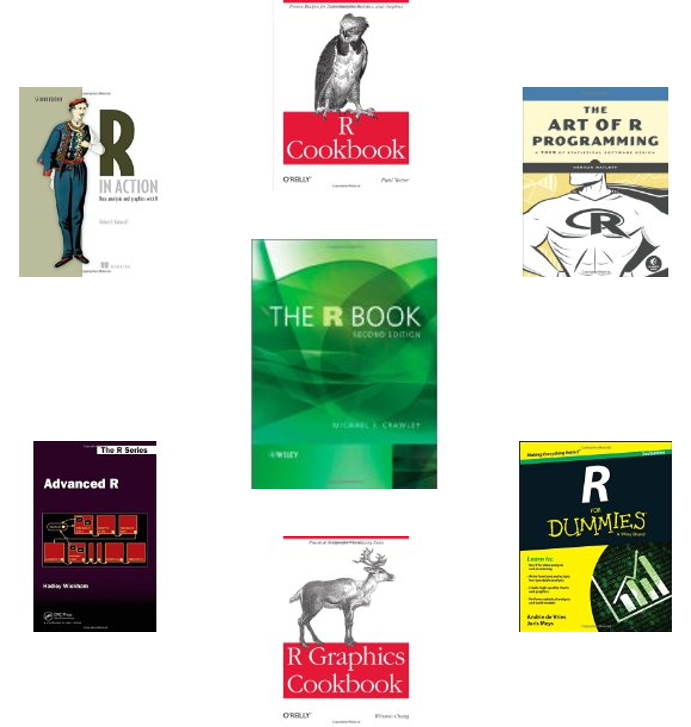

# O professor

## Olá! {.allowframebreaks}

\ttfamily

- Desde __outubro de 2017__ eu sou Professor do __Departamento de Estatística__ e faço parte do Corpo Docente do __Programa de Pós Graduação em Epidemiologia__ da __Universidade Federal do Rio Grande do sul__ (UFRGS). 

- Eu me formei __Bacharel em Estatística__ pelo Departamento de Estatística da UFRGS em __2008__, e __Mestre__ (__2010__) e __Doutor__ (__2014__) __em Estatística__ pelo __Programa de Pós Graduação em Estatística__ da __Universidade Federal de Minas Gerais__ (UFMG).
    + Período de pós-doutoramento no **Programa de Pós-Graduação em Saúde Pública da UFMG** (2015-2017).

\framebreak

- Na graduação eu tenho me concentrado nas disciplinas de __Estatística Descritiva__, __Amostragem__ e __Modelos para dados correlacionados__.
    + Na pós-graduação: **Seminários de Doutorado II e III** e **Análise de Sobrevivência**.

# A disciplina

## Objetivos

- Identificar técnicas básicas para descrição de dados;
- Desenvolver os princípios básicos da inferência estatística;
- Auxiliar na escolha de testes estatísticos apropriados às várias situações básicas de pesquisa.

## Organização

- __Disciplina:__ Fundamentos de Bioestatística
- __Turma:__ U
- __Modalidade:__ Ensino presencial
- __Professor:__ Rodrigo Citton Padilha dos Reis
    + e-mail: `citton.padilha@ufrgs.br` ou `rodrigocpdosreis@gmail.com` 
    + Sala: B215 do Instituto de Matemática e Estatística; 518 do Instituto de Psicologia (Centro de Dados ELSA-Brasil)
- __Monitora:__ Letícia Menegotto

## Aulas e material didático

- __Aulas__ (teóricas e práticas)
    + Exposição e __discussão__ dos conteúdos
        - __Faremos leituras de artigos e capítulos de livros__
    + Exemplos
- __Notas de aula__
    + Slides
    + Arquivos de rotinas em `R`
- __Exercícios__
    + Listas de exercícios
    + Para casa
- __Canais de comunicação:__
    + Durante as aulas
    + Moodle: aulas, materiais, listas de exercícios e __fórum geral__
    + e-mail do professor

## Aulas e material didático

- __Aulas:__ quintas, das 14h às 16h, na __Sala 527 (Lab. de Informática) do Instituto de Psicologia, 5ºandar__ - Campus Saúde

## Aulas e material didático

```{r echo=FALSE, fig.align='center', message=FALSE, warning=FALSE, out.width='10%', paged.print=FALSE}

knitr::include_graphics(here::here('imagens','Rlogo.png'))

```

- Exemplos e exercícios com o apoio do computador:
    + `R` e `RStudio`
    
\footnotesize

```{r, echo=TRUE, eval=TRUE}

library(survival)
fit1 <- survfit(Surv(futime,fustat) ~ resid.ds,
                data = ovarian)

```

\normalsize

```{r km.plot, echo=FALSE, eval=TRUE, fig.align='center', out.width='60%'}

plot(fit1, col = 1:2, xscale = 365.25,
     lwd = 2, mark.time = TRUE,
     xlab = "Years since study entry",
     ylab = "Survival")
legend(750, .9,
       c("No residual disease", "Residual disease"),
       col = 1:2, lwd = 2, bty = 'n')

```
<!-- ```{r, echo=FALSE, eval=TRUE, message=FALSE, warning=FALSE} -->

<!-- evans <- read.csv(file = here::here("dados", "evans.txt"), sep="") -->

<!-- evans$chd <- factor(evans$chd, labels = c("não caso", "novo caso")) -->
<!-- evans$chd.num <- ifelse(evans$chd == "novo caso", 1, 0) -->

<!-- evans$cat <- factor(evans$cat, labels = c("baixo", "alto")) -->
<!-- evans$smk <- factor(evans$smk, labels = c("nunca fumou", "fumante")) -->
<!-- evans$ecg <- factor(evans$ecg, labels = c("ecg normal", "ecg alterado")) -->
<!-- evans$hpt <- factor(evans$hpt, labels = c("normal", "alta")) -->
<!-- evans$cc <- NULL -->
<!-- evans$ch <- NULL -->

<!-- library(ggplot2) -->
<!-- p <- ggplot(data = evans, mapping = aes(x = chl, fill = cat)) + -->
<!--   geom_density(alpha = 0.3) + -->
<!--   labs(x = "Colesterol", y = "Densidade", fill = "Níveis de catecolaminas") + -->
<!--   theme_bw() + theme(legend.position = "bottom") -->

<!-- ``` -->

<!-- ```{r, echo=TRUE, eval=FALSE, warning=FALSE, message=FALSE} -->

<!-- evans <- read.csv(file = here::here("dados", "evans.txt"), sep="") -->

<!-- library(ggplot2) -->
<!-- p <- ggplot(data = evans, mapping = aes(x = chl, color = cat)) + -->
<!--   geom_density() + -->
<!--   labs(x = "Colesterol", y = "Densidade", color = "Níveis de catecolaminas") + -->
<!--   theme_bw() + theme(legend.position = "bottom") -->

<!-- ``` -->

<!-- \normalsize -->

<!-- ```{r, echo=FALSE, eval=TRUE, message=FALSE, warning=FALSE, fig.align='center', out.width="70%", out.height="55%"} -->

<!-- p -->

<!-- ``` -->

## Conteúdo programático {.allowframebreaks}

1. Variabilidade e intervalos de confiança
    + Variabilidade e o papel da estatística
    + Conceitos básicos
    + Levantamentos estatísticos
    + Descrevendo a variabilidade I: técnicas descritivas
    + Descrevendo a variabilidade II: intervalos de confiança
    + Estimando probabilidades: riscos e prevalências
2. comparando riscos e chances
    + Estimando riscos relativos
    + Estimando chances e razões de chances
    + Comparando duas probabilidades ou chances
3. Taxas e estudos caso-controle
    + Medidas de frequência de doença: estimando taxas
    + Estudos caso-controle
    
\framebreak

4. Ajuste para confundimento usando análise estratificada
    + Confundimento
    + Interação: modificação de efeito
5. Padronização e riscos atribuíveis
    + Método da padronização direta
    + Método da padronização indireta
    + Risco atribuível populacional
6. Introdução à regressão logística
    + Regressão logística simples
    + Regressão logística múltipla

## Avaliação

- Serão realizadas três atividades de avaliação: $P_1$, $P_2$ e $P_3$;
- Cada atividade de avaliação vale 10 pontos.
- Será realizada uma prova presencial e individual como atividade de recuperação ($PR$):
    + Para os(as) alunos(as) que não atingirem o conceito mínimo;
    + __Esta prova abrange todo o conteúdo da disciplina__.

## Avaliação

$$
MF = \frac{P_1 + P_2 + P_3}{3}
$$

+ __A:__ $9 \leq MF \leq 10$
+ __B:__ $7,5 \leq MF < 9$
+ __C:__ $6 \leq MF < 7,5$
+ __D:__ $MF < 6$
+ __FF:__ se o(a) aluno(a) tiver frequência inferior a 75% da carga horária prevista no plano da disciplina

## Avaliação

+ Se $MF < 6$ e frequência mínima de 75%, o(a) aluno(a) poderá realizar a prova de recuperação e neste caso

$$
MF' = MF \times 0,4 + PR \times 0,6
$$

- __C:__ $MF' \geq 6$
- __D:__ $MF' < 6$

## Referências bibliográficas

```{r echo=FALSE, fig.align='right', message=FALSE, warning=FALSE, out.width='15%', paged.print=FALSE}
knitr::include_graphics(here::here('imagens','ctanlion.png'))
```

### Principais

\footnotesize

Kahn, H. A.  e Sempos, C. T. __Statistical Methods in Epidemiology__. New York: Oxford University Press, 1989. 

Kleinbaum, D. G., Kupper, L. L., Morgenstern, H. __Epidemiologic Research: Principles and Quantitative Methods__. New York: John Wiley & Sons, 1982.

### Complementares

\footnotesize

Callegari-Jacques, S. M. __Bioestatística: Princípios e aplicações__. Porto Alegre: Artmed, 2003.

Woodward, M. **Epidemiology: Study Design and Data Analysis**, Third Edition. Boca Raton: CRC Press, 2014.

# Epidemiologia e Bioestatística {.allowframebreaks}

\begin{mybox}{Epidemiologia\footnote{Porta M: A Dictionary of Epidemiology, 5th ed. New York, Oxford University Press, 2008.}}
"é o estudo da distribuição e de determinantes de estados ou eventos relacionados com a saúde em populações especificadas e com a aplicação desse estudo para controlar problemas de saúde".
\end{mybox}

- O que deve ser visto com atenção nessa definição é que inclui tanto as descrições do conteúdo da disciplina quanto proposta ou aplicação para as quais as investigações epidemiológicas são realizadas.

\framebreak

Quais são os objetivos específicos da epidemiologia?

1. Identificar a \structure{etiologia} ou a \structure{causa de uma doença} e os fatores de risco relevantes.
2. Determinar a extensão da doença encontrada em uma comunidade.
3. Estudar a história natural e o prognóstico da doença.
4. Avaliar medidas preventivas e terapêuticas e modelos novos ou existentes de assistência à saúde.
5. Fornecer fundamentos para o desenvolvimento de políticas públicas relacionando problemas ambientais, questões genéticas e outras no que diz respeito à prevenção de doenças e promoção da saúde.

\framebreak

- A \structure{epidemiologia} e a \structure{bioestatística} são ciências básicas para a saúde pública (saúde coletiva).
    + Investigações de saúde pública, geralmente, usam \structure{métodos quantitativos} que combinam as duas disciplinas.

- Para investigar uma questão de pesquisa **dados** são necessários.
    + Algumas vezes os dados já estão disponíveis, em outras novos dados precisam ser coletados.

\framebreak

- Dados apresentam \structure{varibilidade}.
- A \structure{estatística} é a ciência que lida com a variação dos dados para obter resultados e conclusões confiáveis.
- A \structure{bioestatística} é a aplicação da estatística a problemas nas ciências biológicas, médicas e da saúde.
    + Os métodos e ferramentas de bioestatística são usados para analisar os dados, resumir a informação e gerar conhecimento para auxiliar a tomada de decisão.

## Analisando dados

```{r echo=FALSE, fig.align='center', message=FALSE, warning=FALSE, out.width='80%', paged.print=FALSE}
knitr::include_graphics(path = here::here('imagens', 'data-detective.jpeg'))
```

## Analisando dados

\structure{Fases de análise}

\begin{columns}[c]
\column{1.2in}
\begin{figure}[!h]
\begin{center}
\includegraphics[width=0.9\columnwidth]{imagens/CoxBook}
\end{center}
\end{figure}
\column{3.4in}
\begin{enumerate}
\item {\small \structure{Manipulação inicial} dos dados.}
\begin{itemize}
\item {\scriptsize Limpeza dos dados.}
\item {\scriptsize Criação, transformação e recodificação de variáveis.}
\end{itemize}
\item {\small \structure{Análise preliminar}.}
\begin{itemize}
\item {\scriptsize Conhecimento dos dados, identificação de outliers, investigação preliminar.}
\end{itemize}
\item {\small \structure{Análise definitiva}.}
\begin{itemize}
\item {\scriptsize Disponibiliza a base para as conclusões.}
\end{itemize}
\item {\small \structure{Apresentação das conclusões} de forma precisa, concisa e lúcida.}
\end{enumerate}
\end{columns}

## Analisando dados

```{r echo=FALSE, fig.align='center', message=FALSE, warning=FALSE, out.width='80%', paged.print=FALSE}
knitr::include_graphics(path = here::here('imagens', 'fluxo_sticker.png'))
```

# Um breve exemplo: prevalência do diabetes

## Definição e diagnóstico do diabetes

## Medição da doença

a proporção de prevalência

## Instrumento de medida

## Flower City

## População e amostra

## Censo e amostragem

## Parâmetros e estatísticas

## A variação amostral

## Variação inter- e intraindivíduo

# O que é o `R`?

## O que é o `R`?

\begin{itemize}\setlength{\itemsep}{+2.5mm}
\item O {\ttfamily R} é uma linguagem de programação desenvolvida para:
\begin{itemize}\setlength{\itemsep}{+1.5mm}
\item Manipulação de dados;
\item Análise estatística;
\item Visualização de dados.
\end{itemize}
\item O que diferencia o {\ttfamily R} de outras ferramentas de análise de dados?
\begin{itemize}\setlength{\itemsep}{+1.5mm}
\item Desenvolvido por estatísticos;
\item É um software livre;
\item É extensível através de pacotes.
\end{itemize}
\end{itemize}
\begin{center}
\includegraphics[width=0.3\columnwidth]{Figuras/Rlogo}
\end{center}

## Breve histórico {.allowframebreaks}

\begin{itemize}\setlength{\itemsep}{+3.5mm}
\item \structure{{\ttfamily R}} é a versão livre, de código aberto, e gratuita do \structure{\sffamily S}.
\begin{itemize}\setlength{\itemsep}{+2.5mm}
\item Nos anos 1980 o \structure{\sffamily S} foi desenvolvido nos \structure{Laboratórios Bell}, por \structure{John Chambers}, para análise de dados e geração de gráficos.
\end{itemize}
\begin{center}
\includegraphics[width=0.25\columnwidth]{Figuras/bell_labs}
\hspace{0.25cm}
\includegraphics[width=0.25\columnwidth]{Figuras/john_chambers}
\end{center}
\framebreak
\item O \structure{{\ttfamily R}} foi inicialmente escrito no começo dos anos 1990.
\begin{itemize}
\item \structure{Robert Gentleman} e \structure{Ross Ihaka} no Dep. de Estatística da Universidade de Auckland.
\item O nome \structure{{\ttfamily R}} se dá em parte por reconhecer a influência do \structure{\sffamily S} e por ser a inicial dos nomes \structure{Robert} e \structure{Ross}.
\end{itemize}
\begin{center}
\includegraphics[width=0.15\columnwidth]{Figuras/University_of_Auckland_Coat_of_Arms}
\hspace{0.25cm}
\includegraphics[width=0.35\columnwidth]{Figuras/Robert_e_Ross}
\end{center}
\item Desde 1997 possui um grupo de 20 desenvolvedores.
\begin{itemize}
\item A cada 6 meses uma nova versão é disponibilizada contendo atualizações.
\end{itemize}
\end{itemize}

## Interface do `R`

\begin{center}
\includegraphics[width=1\columnwidth]{Figuras/R_console}
\end{center}

## Como trabalhar com o `R`?

\begin{itemize}\setlength{\itemsep}{+3.5mm}
\item Por ser uma linguagem de programação, o \structure{{\ttfamily R}} realiza suas tarefas através de \structure{funções} e \structure{operadores}.
\begin{itemize}\setlength{\itemsep}{+2.5mm}
\item A criação de \structure{\emph{scripts}} (rotinas) é \structure{a melhor prática para se trabalhar} com o `R`.
\begin{itemize}\setlength{\itemsep}{+2.5mm}
\item \structure{OBSERVAÇÃO:} sempre salve seus scripts (em um pen drive, dropbox ou e-mail); você pode querer utilizá-los novamente no futuro.
\end{itemize}
\item Utilização de editores de texto: \structure{bloco de notas}, \structure{Notepad ++}, \structure{Tinn-R}, etc.
\item Interfaces de {\ttfamily R} para usuários: \structure{RStudio}.
\end{itemize}
\end{itemize}

## Editores de texto

\begin{center}
\includegraphics[width=0.55\columnwidth]{Figuras/Hello_bloco}
\end{center}

## Editores de texto

\begin{center}
\includegraphics[width=0.65\columnwidth]{Figuras/Hello_notepad}
\end{center}

## Interface do RStudio

\begin{center}
\includegraphics[width=1\columnwidth]{Figuras/RStudio}
\end{center}

## Você pode usar o `R` para

\begin{itemize}
\item \structure{Importação e exportação de dados}
\item \structure{Manipulação de dados}
\begin{itemize}
\item Transformação e recodificação de variáveis
\item Aplicação de filtros
\end{itemize}
\item \structure{Visualização de dados}
\begin{itemize}
\item Diversos gráficos
\item Mapas
\item Gráficos e mapas interativos
\end{itemize}
\item \structure{Análise de dados}
\begin{itemize}
\item Análise descritiva
\item Ajuste de modelos
\item Técnicas multivariadas
\item Análise de amostras complexas
\end{itemize}
\item \structure{Geração de relatórios}
\begin{itemize}
\item Relatórios nos formatos: pdf, HTML, Word, Power Point
\end{itemize}
\end{itemize}
\structure{Resumindo:} você pode usar o `R` em todas as etapas de uma análise de dados!

## Gráficos do `R`

\begin{columns}[c]
\column{2in}
\includegraphics[width=2in]{Figuras/demo-7}
\column{2in}
\includegraphics[width=2in]{Figuras/demo-1}
\end{columns}

## Gráficos do `R`

\begin{columns}[c]
\column{2in}
\includegraphics[width=2in]{Figuras/cluster-1}
\column{2in}
\includegraphics[width=2in]{Figuras/mapa-centrado-BHcity}
\end{columns}

## Gráficos do `R`

\begin{columns}[c]
\column{2in}
\includegraphics[width=2in]{Figuras/geom_bar-28}
\column{2in}
\includegraphics[width=2in]{Figuras/geom_boxplot-24}
\end{columns}

## Gráficos do `R`

\begin{center}
\includegraphics[width=0.8\columnwidth]{Figuras/geom_scatter}
\end{center}

## Gráficos do `R`

\begin{center}
\includegraphics[width=0.65\columnwidth]{Figuras/geom_map-8}
\end{center}

## Gráficos do `R`

\begin{center}
\includegraphics[width=1\columnwidth]{Figuras/flights_sml}
\end{center}

## Gráficos do `R`

\begin{center}
\includegraphics[width=0.75\columnwidth]{Figuras/mapa_mg_kml}
\end{center}

## Gráficos do `R`

\begin{center}
\includegraphics[width=0.5\columnwidth]{Figuras/raster}
\end{center}

## Gráficos do `R`

\begin{center}
\includegraphics[width=0.6\columnwidth]{Figuras/jn-chart}
\end{center}

<!-- ## Gráficos interativos do `R` -->

<!-- \begin{itemize}\setlength{\itemsep}{+3.5mm} -->
<!-- \item \textcolor{blue}{\textsl{\href{https://dl.dropboxusercontent.com/u/18900988/AnnotatedTimeLineID1d481eb33614.htm}{Série temporal: ações da Apple}}} -->
<!-- \item \textcolor{blue}{\textsl{\href{https://dl.dropboxusercontent.com/u/18900988/MotionChartID1d48384d3b3f.htm}{Motion Chart}}} -->
<!-- \end{itemize} -->

## Comunicação de resultados através do `R`: `R Markdown`

\begin{columns}[c]
\column{1.9in}
\begin{figure}[!h]
\begin{center}
\includegraphics[width=0.9\columnwidth]{Figuras/bandThree2}
\end{center}
\end{figure}
\column{2.7in}
\begin{enumerate}
\item {\small Produz \structure{documentos dinâmicos} em {\ttfamily R}.}
\item {\small Documentos {\ttfamily R Markdown} são completamente \structure{reproduzíveis}.}
\item {\small {\ttfamily R Markdown} suporta dezenas de formatos de saída, incluindo \structure{HTML}, \structure{PDF}, \structure{MS Word}, \structure{Beamer}, \structure{ \emph{dashboards}}, \structure{aplicações {\ttfamily shiny}}, \structure{artigos científicos} e muito mais.}
\end{enumerate}
\end{columns}

## Comunicação de resultados através do `R`: `CompareGroups`

```{r echo=FALSE, fig.align='center', message=FALSE, warning=FALSE, out.width='90%', paged.print=FALSE}
knitr::include_graphics(path = here::here('Rmds', 'Figuras', 'compare_groups.png'))
```

## Comunicação de resultados através do `R`: `stargazer`

```{r echo=FALSE, fig.align='center', message=FALSE, warning=FALSE, out.width='80%', paged.print=FALSE}
knitr::include_graphics(path = here::here('Rmds', 'Figuras', 'stargazer.png'))
```

## Comunicação de resultados através do `R`

```{r echo=FALSE, fig.align='center', message=FALSE, warning=FALSE, out.width='60%', paged.print=FALSE}
knitr::include_graphics(path = here::here('Rmds', 'Figuras', 'forest.jpg'))
```

## Comunicação de resultados através do `R`

```{r echo=FALSE, fig.align='center', message=FALSE, warning=FALSE, out.width='80%', paged.print=FALSE}
knitr::include_graphics(path = here::here('Rmds', 'Figuras', 'coef_variacao_modelo-1.png'))
```

## Comunicação de resultados através do `R`: `Shiny`

- `Shiny` é um pacote do `R` que torna mais fácil a construção de \structure{aplicações web interativas} (apps) diretamente do `R`.
    + Permite a criação e compartilhamento de aplicativos.
    + Espera \structure{nenhum conhecimento} de tecnologias web como HTML, CSS ou JavaScript (mas você pode aproveitá-las, caso as conheça)
    + Um aplicativo `Shiny` consiste em duas partes: uma \structure{interface de usuário} (UI) e um \structure{servidor}.

## `Shiny`

\footnotesize

```{r, echo=TRUE, eval=FALSE}
# Run the application 
shinyApp(ui = ui, server = server)
```

\begin{columns}[c]
\column{2.3in}
\begin{figure}[!h]
\begin{center}
\includegraphics[width=0.9\columnwidth]{Figuras/shinyAppEx1}
\end{center}
\end{figure}
\column{2.3in}
\begin{figure}[!h]
\begin{center}
\includegraphics[width=0.9\columnwidth]{Figuras/shinyAppEx2}
\end{center}
\end{figure}
\end{columns}

# Introdução ao `R`

## Baixando e instalando o `R`

Para instalação do `R` acesse o site https://www.r-project.org/:

1. Em __Download__ clique em CRAN.
    + O __CRAN__ (_The Comprehensive R Archive Network_) é uma rede de servidores ftp e web em todo o mundo que armazena versões de código e documentação idênticas e atualizadas para o `R`.
2. Escolha um repositório de sua preferência, por exemplo, Universidade Federal do Paraná (http://cran-r.c3sl.ufpr.br/).
3. Em __Download and Install R__ clique no link adequado para o seu sistema operacional (no caso de Windows, clique no link __Download R for Windows__).
4. Clique no link __base__ (no caso do sistema operacional ser Windows).
5. Finalmente clique no link para baixar o arquivo executável (a versão mais atual __Download R 4.3.3 for Windows__).

Após baixar o arquivo executável, abra-o e siga as etapas de instalação conforme as configurações padrões.

## Baixando e instalando o `RStudio`

Para instalação do `RStudio` acesse o site https://www.rstudio.com/products/rstudio/download/. 

- Em __Install RStudio__, clique no botão __DOWNLOAD RSTUDIO DESKTOP FOR WINDOWS__ para baixar a versão mais recente do instalador do `RStudio` (no caso de Windows,  __RSTUDIO-2023.12.1-402__).

## Pacotes {.allowframebreaks}

- Assim como a maioria dos softwares estatísticos, o `R` possui os seus "módulos", mais conhecidos como __pacotes__ do `R`.
- __Pacote:__ é uma coleção de funções do `R`; os pacotes também são gratuitos e disponiblizados no __CRAN__.
- Um pacote inclui: __funções__ do `R`, __conjuntos de dados__ (utilizados em exemplos das funções), arquivo com __ajuda__ __(_help_)__, e uma __descrição__ do pacote.
- Atualmente, o repositório oficial do `R` possui mais de 20.500  pacotes disponíveis.
- As funcionalidades do `R`, podem ser ampliadas carregando estes pacotes, tornando-o um software muito poderoso, capaz de realizar inúmeras tarefas.

## Pacotes {.allowframebreaks}

- Alguns exemplos destas tarefas e alguns destes pacotes são listados abaixo:
    + __Importação e exportação de dados__
        - `foreign`, `readr`, `haven`
    + __Manipulação de dados__
        - Transformação e recodificação de variáveis: `reshape2`, `stringr`
    + __Visualização de dados__
        - Diversos gráficos: `graphics`, `ggplot2`, `ggthemes`
        - Mapas: `ggmap`
        - Gráficos e mapas interativos: `plotly`
    + __Análise de dados__
        - Análise descritiva: `compareGroups`
        - Ajuste de modelos: `stats`, `survival`
        - Análise de amostras complexas: `survey`
    + __Geração de relatórios__
        - Relatórios nos formatos pdf, HTML, Word, Power Point: `knitr`, `rmarkdow`, `officer`

<!-- ## Exemplos de pacotes -->

<!-- - `maptools`: Funções para leitura, exportação e manipulação de estruturas espaciais. -->
<!-- - `epibasix`: Ferramentas elementares para análise de problemas epidemiológicos. -->
<!-- - `survey`: Análise de pequisas com planos amostrais complexos. -->
<!-- - `ggplot2`: Criação de gráficos elegantes. -->
<!-- - `survival`: Análise de dados de sobrevivência . -->
<!-- - O `R` possui mais de \alert{10.751} pacotes, e milhares de funções. -->
<!-- - \structure{Resumindo:} para o `R` não existe o \alert{"SE É POSSÍVEL FAZER"}, mas sim, \alert{"COMO É POSSÍVEL FAZER"}! -->


## Instalando pacotes {.allowframebreaks}

- Para \structure{instalação de um pacote}, basta um simples comando.

```{r, echo=TRUE, eval=FALSE}
install.packages("survey")
```

- Além da opção de comando, também podemos instalar pacotes utilizando o menu \structure{Tools} do `RStudio`, opção \structure{Install packages ...} e preenchendo com o(s) nome(s) do(s) pacote(s):

\begin{center}
\includegraphics[width=0.4\columnwidth]{Figuras/install_packs}
\end{center}

- Outra opção é instalar o pacote a partir de seu arquivos fonte (\structure{.zip} ou \structure{.tar.gz}):
    + Para isso, obtenha o arquivo fonte do pacote (geralmente através do \structure{CRAN}) e no menu \structure{Tools} do `RStudio`, opção \structure{Install packages ...} em \structure{Install from} escolha a seguinte opção:

\begin{center}
\includegraphics[width=0.4\columnwidth]{Figuras/install_packs2}
\end{center}

Após a instalação do pacote, temos que \structure{carregar o pacote} para nossa área de trabalho para podermos usufruir de suas funções.

```{r, echo=TRUE, eval=FALSE}
library("survey")
require("survey")
```

## Obtendo ajuda no R {.allowframebreaks}

- Para conhecer quais as funções disponíveis no pacote, faça:

```{r, echo=TRUE, eval=FALSE}
help(package = "survey")
```

- Para pedir ajuda de uma determinada função:

```{r, echo=TRUE, eval=FALSE}
?glm
help("glm")
```

- Obtendo ajuda na internet:

```{r, echo=TRUE, eval=FALSE}
help.search("t.test")
```

\framebreak

- Procurando por alguma função, mas esqueci o nome:

```{r, echo=TRUE, eval=FALSE}
apropos("lm")
```

- Para todas as outras dúvidas existe o \alert{{\bf Google!}}
- Ver também \alert{http://www.r-bloggers.com/} e \alert{https://rstudio.cloud/}
- Para algumas demonstrações da capacidade gráfica do `R`:

```{r, echo=TRUE, eval=FALSE}
demo(graphics)
demo(persp)
demo(Hershey)
demo(plotmath)
```

## Algumas referências

```{r echo=FALSE, fig.align='center', message=FALSE, warning=FALSE, out.width='50%', paged.print=FALSE}

```
